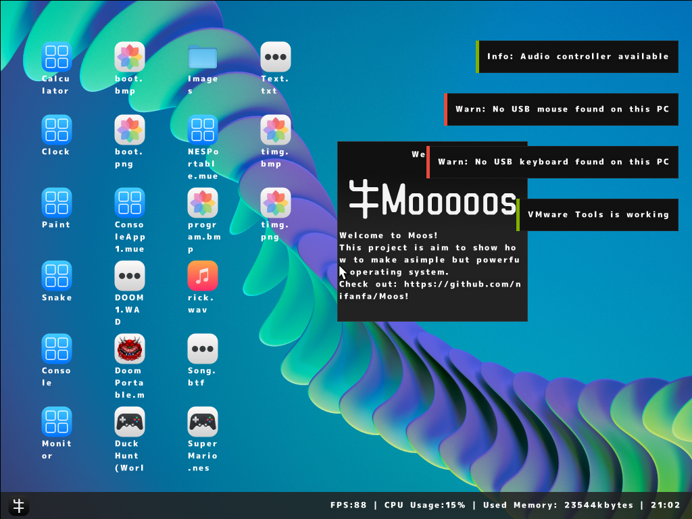

## Building
For information on compiling MOOS, please read the [build wiki page]([https://github.com/nifanfa/MOOS/wiki/How-do-you-build-or-compile-MOOS%3](https://github.com/nifanfa/MOOS/wiki)F).

### Build requirements
- VMware Workstation Player - https://www.vmware.com/products/workstation-player.html
- Visual studio 2022 - https://visualstudio.microsoft.com/
- QEMU - https://www.qemu.org/download or VMWare ( Note - USB Does not work with VMWare and you need x64 if you want to run VMware, 32 bit is not supported )
- Windows 10-11 x64 or x86
- A CPU from at least 2012 or newer, or in basic terms an Ivy Bridge CPU or over
- 4GB of RAM but 8GB is recommended

 

 

## Features

| Feature | Working in VM | Working on hardware | Information |
| ------- | ------------- | ------------------- | ----------- |
| Applications .mue (MOOS User Executable) | 🟩 | 🟩 |
| Error Throwing / Catching | 🟥 | 🟥 | 
| GC | 🟨 | ⬜ | Not safe |
| Multiprocessor | 🟩 | 🟩 |
| Multithreading | 🟩 | 🟩 |
| EHCI(USB2.0) | 🟩 | 🟩 |
| USB Keyboard | 🟨 | ⬜ |
| USB Mouse | 🟩 | ⬜ |
| USB HUB | 🟥 | 🟥 |
| PS2 Keyboard/Mouse(USB Compatible) | 🟩 | 🟩 |
| Nintendo Family Computer Emulator | 🟩 | 🟩 |
| DOOM(doomgeneric) | 🟩 | 🟩 |
| Intel® Gigabit Ethernet Network | 🟩 | 🟩 |
| Realtek RTL8111E | 🟩 | 🟩 |
| ExFAT | 🟩 | ⬜ |
| I/O APIC | 🟩 | 🟩 |
| Local APIC | 🟩 | 🟩 |
| SATA | 🟩 | ⬜ |
| IDE | 🟩 | 🟩 |
| SMBIOS | 🟩 | 🟩 |
| ACPI | 🟩 | 🟩 |
| IPv4 | 🟩 | 🟩 |
| IPv6 | 🟥 | 🟥 |
| TCP | 🟩 | 🟩 |
| UDP | 🟩 | 🟩 |
| DNS | 🟩 | 🟩 |
| DHCP | 🟩 | 🟩 |
| Lan | 🟩 | 🟩 |
| Wan | 🟩 | 🟩 |

| Color Key | Meaning |
| ----- | ------- |
| 🟩 | Yes |
| 🟥 | No |
| 🟨 | W.I.P / Partially / Buggy |
| ⬜ | Unknown |

## Contact me 联系方式
Email: nifanfa@foxmail.com (i hardly use that so it may took a few month to check your post)  
QQ: 3244735564  
QQ群: 686383293  
Discord: https://discord.gg/uJstXbx8Pt  
